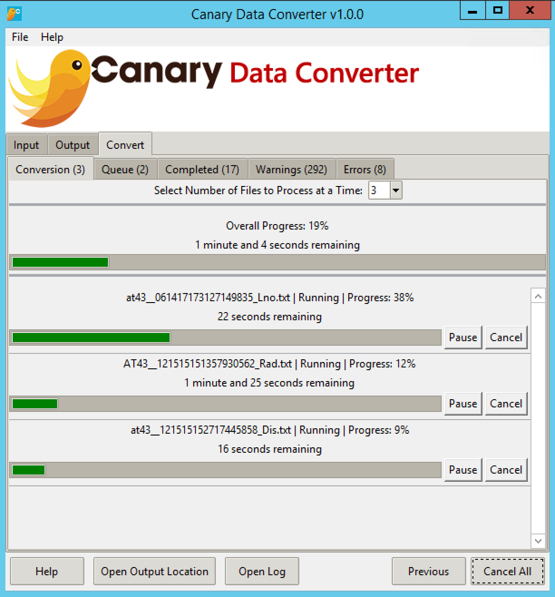

Canary Data Converter
=====
Documentation by Peter Goldberg
<br>Last Updated: August 24, 2017

### Screensot


#### What is Canary Data Converter?
Canary Data Converter is a user-friendly, extendable conversion tool written in Python with a graphical user interface and a command-line interface. Although originally written to manipulate text files, it has the potential to convert almost any format. The converter also has the ability to utilize multiprocessing to convert multiple files in parallel.

#### Can I add new formats to Canary Data Converter?
Adding formats to the Canary Data Converter is very simple. There are two main packages that are responsible for converting files, the `read` package and the `write` package, which are comprised of [reader classes](#reader-specifications) and [writer classes](#writer-specifications), respectively. The readers will read in the input file and store its data in a dictionary, and the writers will manipulate the data from the dictionary and output the result to the output file. So, in order to add a new input format, you only need to write a reader class for that format, and to add a new output format, you only need to write a writer class. The interfaces will dynamically retrieve the readers and writers from the packages, so no extra coding is required to add new formats. The requirements for readers and writers are specified below.

---

## Reader Specifications
There are a few core requirements that all readers must have. To better understand how readers work, let's look at an example:
```python
class ReadTXT(Read):
    """.txt Reader"""

    # required class variables for extensions, interface labels, and description
    EXTENSIONS = ['txt']
    GUI_LABELS = ['Plain Text']
    CLI_LABELS = ['txt']
    DESCRIPTION = 'All files with the ".txt" extension.'

    # required UC_PROPS class variable
    UC_PROPS = [
        {'flag': '--indirsubdir',
         'name': '--input-dir-subdir',
         'label': 'Folder and Subfolders',
         'action': 'store',
         'default': None,
         'type': str,
         'help': ('Choose a directory that contains subfolders with files to be 
                 'converted'),
         'var': 'input_dir_subdir',
         'intype': 'dir',
         'position': -1000},
        {'flag': '--indir',
         'name': '--input-dir',
         'label': 'Single Folder',
         'action': 'store',
         'default': None,
         'type': str,
         'help': 'Choose a directory that contains all files to be converted',
         'var': 'input_dir',
         'intype': 'dir',
         'position': -999},
        {'flag': '--infile',
         'name': '--input-file',
         'label': 'File',
         'action': 'store',
         'default': None,
         'type': str,
         'help': 'Choose a single file to convert',
         'var': 'input_file',
         'intype': 'file',
         'position': -998},
        {'flag': '--renc',
         'name': '--r-encoding',
         'label': 'Encoding',
         'action': 'store',
         'default': 'utf8',
         'type': str,
         'help': ('Choose what encoding to use for reading the input file. '
                 'utf8 is the default, which will work for most files.'),
         'var': 'r_encoding',
         'gui_choices': sorted(aliases.keys()),
         'position': 4,
         'required': True}
    ]
    # sort the UC_PROPS on the position key
    UC_PROPS = sorted(UC_PROPS, key=lambda k: k['position'])

    def __init__(self, *args, **kwargs):
        super().__init__(*args, **kwargs)
        self.info['data'] = []
        self.info['metadata'].update({
                'filename': os.path.basename(self.info['metadata']['location']),
                'filepath': self.info['metadata']['location'],
                'size': os.path.getsize(self.info['metadata']['location'])
        })
        self.progress.update({
            'filename': self.info['metadata']['filename'],
            'size': self.info['metadata']['size']
        })
        # check that the file is not empty
        if not self.progress['size'] > 0:
            # put_error will put a progress dict in, so don't put another in
            self.put_error(self.info['metadata']['filename'], 'File has no content.')
        else:
            # if there's no error, report the progress
            self.prog_wait(self.progress)

    def read_data(self):
        """Generator to yield lines in file"""
        # open the file using with statement to avoid having to close file
        with open(self.info['metadata']['filepath'],
                  'r',
                  encoding=self.options['r_encoding']) as file:
            # set state to Reading
            self.progress['state'] = 'Reading'
            # put the progress dict without waiting
            self.prog_nowait()
            # iterate through lines in file
            for index, line in self.file_gen(file):
                # add the line to the info dictionary
                self.info['data'].append(line)
            # set the state to writing
            self.progress['state'] = 'Writing'
            # flush the read-ahead buffer, get position, report progress
            file.flush()
            self.progress['progress'] = file.tell()
            # let it block if it needs to, this message must go through
            self.prog_wait()
            # yield the info dictionary
            # although this seems weird as a generator that only yields once,
            # it's necessary so that the writers work with all readers
            yield self.info
```

Let's break this apart:

#### This reader inherits from the [base `Read` class](#the-readread-class).
I recommend that all readers inherit from the [`Read` class](#the-readread-class). The class comes with several built in functions that will be particularly helpful for reporting progress, warnings, errors, and messages. It is possible to create a reader that does not inherit from the [`Read` class](#the-readread-class), but you will have to fully understand how the interfaces communicate the progress and messages between the processes to ensure there are no issues with multiprocessing.

The base [`Read` class](#the-readread-class) expects 2 required arguments upon instantiation: `options` and `file_location`, and two optional keyword arguments: `progress_queue` and `msg_queue`.

- `options` - This is where all of the user-customizable properties go for the reader. It is a dictionary, and the keys for each option's value is what you enter for `'var'` in each [UC_PROP](#uc_props).
- `file_location` - This will be whatever UC_PROP `'intype'` (input source type) was selected. Right now, Canary Data Converter only accepts file and directory inputs.

- `progress_queue` - This is the multiprocessing.Queue that Canary Data Converter uses to report progress to the interfaces.
- `msg_queue` - This is the multiprocessing.Queue that Canary Data Converter uses to communicate messages to the processes.

##### As long as your reader is properly coded, if you are using the interfaces, these arguments will automatically be passed to the reader when the conversion is started. You should never need to actually instantiate a reader yourself, unless you are not using the provided interfaces.

#### There are 5 required class variables for every reader: 

`EXTENSIONS` - This variable is a list of the file extensions that the reader will accept. For this example plain text reader, the only extension it accepts is `.txt`.

`GUI_LABELS` - This variable is a list of the labels to show for the reader in the GUI. If you have more than one label, then the user will be able to convert the same file using two different input formats listed in the GUI. You may want to have more than one label if there are multiple different names for the same extension.

`CLI_LABELS` - Like `GUI_LABELS`, this variable is a list of all the labels available as input format options in the CLI. For this variable, it is advisable to have more than one label, as it will make the CLI easier to use.

`DESCRIPTION` - This variable stores a description of the input format that will be displayed in the GUI's context-sensitive help window.

`UC_PROPS` - This variable is a list of dictionaries where all of the user-customizable properties for the input are stored. This is an incredibly important variable, as it is what the interfaces use to give the user options for the input format. As options can differ greatly, there is a lot of information that can go into each property. For more info on the `UC_PROPS` class variable, read the [`UC_PROPS` section](#uc_props).

#### There are also a couple instance variables defined in the [base `Read` class](#the-readread-class) class that you should use
`read.Read.info` - this is a dictionary that holds all of the data and metadata for the input. This is what the readers and writers use to communicate with each other. There are only a few entries by default:

- `'data'` - This is initialized to `None`, but it is what our medical record readers use to store the actual text from each medical record. We use this as a list, but you can implement your readers and writers to use this however you like.

- `'metadata'` - This is a nested dictionary that contains all of the metadata from the input file. This has a couple of very important entries
    - `'conversion_id'` - This is what the CLI uses to differentiate between different files when reporting progress. It is also used in the logs to signify the start of processing for an input file, so this should be an identifier that is unique for each input. We used the input file paths for our text readers. If you do not include this, the [base `Read` class](#the-readread-class) class will just assign it a random number so that the progress reporting will work correctly and so that the CLI can distinguish one input from another.
    - `'location'` - This just stores the location of the input as provided in the `file_location` argument to the constructor of the [base `Read` class](#the-readread-class) class. For files, this can just be the file path. In the future, we may add support for database input, whcih would cause this to be different.


`read.Read.progress` - this is a dictionary that the reader uses to report progress to the interface. The main entries that would be of interest to you if you are writing a reader are:

- `'conversion_id'` - you should set this to be the same as the `'conversion_id'` in the `info['metadata']` dictionary.
- `'filename'` - this is what the GUI uses to label progress information. This could be the same as the `conversion_id`, if you want.
- `'size'` - this is the total size of the input. For file input, this can be bytes, megabytes, etc.
- `'progress'` - this is the size of what has been processed. Progress will be calculated by determining what percent of the `'size'` `'progress'` is.
- `'state'` - this is what state the processing is currently in (Waiting, Running, Finished, etc.)


#### As long as you have these required class and instance variables, you have a (non-functional) reader that will appear in the interfaces.
To make this reader functional, you only need to add an [input type (see Input Types)](#input-source-types) and create a method of reading in the data.

For an idea on how to create a method to read in your files, look at our example text readers. These readers employ a `read_data()` method that is a generator and will yield an `info` dictionary containing the data and metadata from the input file to the writer as the writer requests it through the generator. In the delimited readers, the generator will yield each delimited document as it is requested.

### The `read.ReaderError(`*`message`*`)`
We recommend using the [`put_error(`*`filename, message, stack_info=None`*`)`](#put_errorfilename-message-stack_infonone) method, which will raise this error, to report error messages. You can, however, raise the `read.ReaderError(`*`message`*`)` and the message will still be handled, logged, and reported in the interface.

---

## Writer Specifications
There are a few core requirements that all writers must have. To better understand how writers work, let's look at an example:
```python
class WriteTXT(Write):
    """.txt Writer"""
    # required class variables for interface labels and description
    GUI_LABELS = ['Plain Text']
    CLI_LABELS = ['txt', 'text', 'plain_text']
    DESCRIPTION = 'All files with the ".txt" extension.'

    # UC_PROPS class variable with the base class UC_PROPS added
    UC_PROPS = Write.UC_PROPS + [
        {'flag': '--outdir',
         'name': '--output-directory',
         'label': 'Folder',
         'action': 'store',
         'default': None,
         'type': str,
         'help': 'Choose the directory to write the converted files to',
         'var': 'output_dir',
         'outtype': 'dir',
         'position': -1001,
         'required': False},
        {'flag': '--name',
         'name': '--output-filename',
         'label': 'Output Filename',
         'action': 'store',
         'default': None,
         'type': str,
         'help': 'The name for your output file(s)',
         'var': 'output_filename',
         'position': -1000,
         'required': False},
        {'flag': '--wenc',
         'name': '--w-encoding',
         'label': 'Encoding',
         'action': 'store',
         'default': 'utf8',
         'type': str,
         'help': ('Choose what encoding to use for writing the output file.'
         ' utf8 is the default, which will work for most files.'),
         'var': 'w_encoding',
         'gui_choices': sorted(aliases.keys()),
         'position': 1,
         'required': True},
        {'flag': '--ibl',
         'name': '--ignore-blank-lines',
         'label': 'Ignore Blank Lines',
         'action': 'store_true',
         'default': False,
         'help': 'Choose whether to ignore blank lines when writing file',
         'var': 'ignore_blank_lines',
         'position': 2,
         'required': False},
        {'flag': '--lc',
         'name': '--lowercase',
         'label': 'Lowercase',
         'action': 'store_true',
         'default': False,
         'help': 'Write the output file in all lowercase',
         'var': 'lowercase',
         'position': 3,
         'required': False},
        {'flag': '--wrap',
         'name': '--text-wrap',
         'label': 'Text Wrapping',
         'action': 'store',
         'gui_default': 40,
         'default': None,
         'type': int,
         'help': 'Wrap text with the specified line length (in characters).',
         'var': 'text_wrap',
         'position': 5,
         'required': False},
    ]

    # sort the UC_PROPS on the position key
    UC_PROPS = sorted(UC_PROPS, key=lambda k: k['position'])

    def __init__(self, options, read_file):
        super().__init__(options, read_file)
        # if the filename was provided, make sure the extension is there
        if self.options['output_filename'] is not None:
            if self.options['output_filename'].split('.')[-1] != 'txt':
                self.options['output_filename'] += '.txt'
        # else create the filename from input
        else:
            # get input filename
            filename = self.read_file.info['metadata']['filename']
            # make sure you make the extension .txt
            namelist = filename.split('.')
            namelist[-1] = 'txt'
            # join it back together
            filename = '.'.join(namelist)
            # set the output filename
            self.options['output_filename'] = filename

        self.wrap = None
        if self.options["text_wrap"]:
            import textwrap
            self.wrap = textwrap.TextWrapper(self.options["text_wrap"])

    def write_dir(self):
        """Writes file(s) to a directory"""
        # check for messages before writing so we don't write an empty file
        self.read_file.check_msg_queue()
        # count files so we can distinguish multiple output files
        count = 1
        # iterate through records yielded by reader generator
        for info in self.read_file.read_data():
            # add numbers to output filename for multiple file output
            name = self.options['output_filename'].split('.')
            name[-2] = '{} ({})'.format(name[-2], count)
            name = '.'.join(name)
            path = os.path.join(self.options['output_dir'], name)
            # make sure you aren't overwriting
            path = self.get_safe_path(path)
            # get buffer size
            buffer = cdc.CONFIG.getint('WRITE', 'OutputBufferSize', fallback=8192)
            # open output file for writing
            with open(path, 'w', buffer, encoding=self.options['w_encoding']) as file:
                # run it through process_data generator and write line-by-line
                file.write(self.get_document(info))
            # increment count for the next file
            count += 1
        # VERY IMPORTANT THAT THIS NEXT PART HAPPENS
        # set the state to finished and report the progress
        self.read_file.progress['state'] = 'Finished'
        self.read_file.progress_queue.put(self.read_file.progress)

    def process_data(self, info):
        """Generator for processing the data with the UC_PROPS"""
        # go through the lines
        for i, line in enumerate(info['data']):
            # process it from user-specified properties
            if self.options['ignore_blank_lines'] and line.strip() == '':
                continue
            if self.options['lowercase']:
                info['data'][i] = line.lower()
			
        # text wrapping
        if self.wrap:
            info["data"] = self.wrap.wrap(''.join(info['data']))
            info["data"] = [line + "\n" for line in info["data"]]

        return info

    def get_document(self, info):
        document = ''.join(self.process_data(info)['data'])
        return document
```

Let's break this apart:

#### This writer inherits from the [base `Write` class](#the-writewrite-class).
I recommend that all writers inherit from the [`Write` class](#the-writewrite-class). The class comes with some built in functions that will help with overwrite protection, and potentially other functions in future commits. It is possible to create a writer that does not inherit from the [`Write` class](#the-writewrite-class), but it must accept the same arguments in order to be compatible with the interfaces. I would recommend using the [`Write` class](#the-writewrite-class) to ensure proper usage with the interfaces.

The base [`Write` class](#the-writewrite-class) expects 2 required arguments upon instantiation: `options` and `read_file`.

- `options` - This is where all of the user-customizable properties go for the reader. It is a dictionary, and the keys for each option's value is what you enter for `'var'` in each [UC_PROP](#uc_props).
- `read_file` - This is the instantiation of the reader that the writer is using to get the input data. The writer can get all of the reader information with this object.

##### As long as your writer is properly coded, if you are using the interfaces, these arguments will automatically be passed to the writer when the conversion is started. You should never need to actually instantiate a writer yourself, unless you are not using the provided interfaces.

#### There are 4 required class variables for every writer:

`GUI_LABELS` - This variable is a list of the labels to show for the writer in the GUI. If you have more than one label, then the user will be able to convert the same file using two different output formats listed in the GUI. You may want to have more than one label if there are multiple different names for the same extension.

`CLI_LABELS` - Like `GUI_LABELS`, this variable is a list of all the labels available as output format options in the CLI. For this variable, it is advisable to have more than one label, as it will make the CLI easier to use.

`DESCRIPTION` - This variable stores a description of the output format that will be displayed in the GUI's context-sensitive help window.

`UC_PROPS` - This variable is a list of dictionaries where all of the user-customizable properties for the output are stored. This is an incredibly important variable, as it is what the interfaces use to give the user options for the output format. As options can differ greatly, there is a lot of information that can go into each property. For more info on the `UC_PROPS` class variable, read the [`UC_PROPS` section](#uc_props).

### There is 1 required function that all writers must have:
Every writer must have at least 1 write function. You must have a write function for every available `'outtype'` This is just a function that writes the output file. The format for the name of the function is write_[outtype](#output-location-types)(). This is the method that is called to begin file processing.

Right now, since Canary Data Converter only supports directory input, your writer must have a `write_dir()` method.

#### As long as you have these required class variables and methods, you have a (possibly non-functional) writer that will appear in the interfaces.
To make this writer functional, you only need to add an [output type (see Ouptut Types)](#output-location-types) and create a method of processing and writing out the data.

The way the writer processes the input data and write the output is left entirely up to you. For some ideas, look at our example text writers. These writers have `process_data()` methods and `get_document()` methods that process the documents. The `get_document()` method is called from the write method, `write_dir`, and it calls the `process_data()` method, which processes the input document line-by-line, and then uses that output to build a string for the document. That string is then returned to `write_dir()`, where it is written to the output file.

## The `read.Read` Class
The `read.Read` class should be used as the base class for all readers. To see an example of a reader that inherits from the `read.Read` class, look at the [example in the Reader Specifications.](#reader-specifications)

*class* `read.Read(`*`options, file_location, progress_queue=None, msg_queue=None`*`)`

- `options` - This is where all of the user-customizable properties go for the reader. It is a dictionary, and the keys for each option's value is what you enter for `'var'` in each [UC_PROP](#uc_props).
- `file_location` - This will be whatever UC_PROP `'intype'` (input source type) was selected. Right now, Canary Data Converter only accepts file and directory inputs.

- `progress_queue` - This is the multiprocessing.Queue that Canary Data Converter uses to report progress to the interfaces.
- `msg_queue` - This is the multiprocessing.Queue that Canary Data Converter uses to communicate messages to the processes.

The `read.Read` class also provides methods that prove particularly useful for reporting progress, warnings, and errors and for checking for messages from the main process.

### `read.Read` Class Built-in Methods
#### `check_msg_queue()`

&nbsp;&nbsp;&nbsp;&nbsp;&nbsp;Call this method to check for messages from the main process. This is how 
<br>&nbsp;&nbsp;&nbsp;&nbsp;&nbsp;processes can be paused or cancelled from the interfaces. It is also what tells 
<br>&nbsp;&nbsp;&nbsp;&nbsp;&nbsp;the process to stop when there is an error. This function is called within 
<br>&nbsp;&nbsp;&nbsp;&nbsp;&nbsp;[`file_gen()`](#file_gen), so if you use this generator to report progress, you 
<br>&nbsp;&nbsp;&nbsp;&nbsp;&nbsp;may only have to call this function very rarely.

#### `file_gen(`*`file`*`)`

&nbsp;&nbsp;&nbsp;&nbsp;&nbsp;This is a generator built using `enumerate()` that you can use to automatically 
<br>&nbsp;&nbsp;&nbsp;&nbsp;&nbsp;report progress when reading in your input files. The *`file`* argument expects 
<br>&nbsp;&nbsp;&nbsp;&nbsp;&nbsp;a reference to a file. This generator will yield two-tuples of the index and the
<br>&nbsp;&nbsp;&nbsp;&nbsp;&nbsp;line value.

#### `refresh_file_prog(`*`file`*`)`

&nbsp;&nbsp;&nbsp;&nbsp;&nbsp;This method will update the progress dictionary with the reading location in the
<br>&nbsp;&nbsp;&nbsp;&nbsp;&nbsp;file. This expects a reference to a file as the *`file`* argument.

#### `prog_wait()`

&nbsp;&nbsp;&nbsp;&nbsp;&nbsp;This method will simply send the progress dictionary to the `progress_queue`, 
<br>&nbsp;&nbsp;&nbsp;&nbsp;&nbsp;and it will block until it successfully puts it into the queue.

#### `prog_nowait()`

&nbsp;&nbsp;&nbsp;&nbsp;&nbsp;This method will simply send the progress dictionary to the `progress_queue`, 
<br>&nbsp;&nbsp;&nbsp;&nbsp;&nbsp;but it will not put it into the queue if the queue is full.

#### `put_warning(`*`filename, message, line=None`*`)`

&nbsp;&nbsp;&nbsp;&nbsp;&nbsp;This method will put a warning into the `process_queue` so it can be relayed to 
<br>&nbsp;&nbsp;&nbsp;&nbsp;&nbsp;the interfaces and the logger. It has 2 required arguments: *`filename`*, which 
<br>&nbsp;&nbsp;&nbsp;&nbsp;&nbsp;is simply a string containing the filename, and *`message`*, which is a string 
<br>&nbsp;&nbsp;&nbsp;&nbsp;&nbsp;containing the warning message to output in the interface and the logger. It 
<br>&nbsp;&nbsp;&nbsp;&nbsp;&nbsp;also has an optional *`line`* argument that accepts an integer for the line 
<br>&nbsp;&nbsp;&nbsp;&nbsp;&nbsp;number the warning corresponds to.

#### `put_error(`*`filename, message, stack_info=None`*`)`

&nbsp;&nbsp;&nbsp;&nbsp;&nbsp;This method will raise a `read.ReaderError`, which will terminate processing 
<br>&nbsp;&nbsp;&nbsp;&nbsp;&nbsp;of the file and put an error into the `process_queue` so it can be relayed to the 
<br>&nbsp;&nbsp;&nbsp;&nbsp;&nbsp;interfaces and the logger. It has 2 required arguments: *`filename`*, which is 
<br>&nbsp;&nbsp;&nbsp;&nbsp;&nbsp;simply a string containing the filename,and *`message`*, which is a string containing 
<br>&nbsp;&nbsp;&nbsp;&nbsp;&nbsp;the error message to output in the interface and the logger. It also has an optional 
<br>&nbsp;&nbsp;&nbsp;&nbsp;&nbsp;*`stack_info`* argument that accepts a string containing stack traceback 
<br>&nbsp;&nbsp;&nbsp;&nbsp;&nbsp;information for more detailed warning messages.


## The `write.Write` Class
The `write.Write` class should be used as the base class for all writers. To see an example of a writer that inherits from the `write.Write` class, look at the [example in the Writer Specifications.](#writer-specifications)

*class* `write.Write(`*`options, read_file`*`)`

- `options` - This is where all of the user-customizable properties go for the reader. It is a dictionary, and the keys for each option's value is what you enter for `'var'` in each [UC_PROP](#uc_props).
- `read_file` - This is the instantiation of the reader that the writer is using to get the input data. The writer can get all of the reader information with this object.

The `write.Write` class also provides methods to help with writing the output file.

### `write.Write` Class Built-in Methods
#### `get_safe_path(`*`path`*`)`

&nbsp;&nbsp;&nbsp;&nbsp;&nbsp;Call this method before opening the output file to ensure you don't overwrite an
<br>&nbsp;&nbsp;&nbsp;&nbsp;&nbsp;existing file. It will accept a *`path`* string and return a path that is safe 
<br>&nbsp;&nbsp;&nbsp;&nbsp;&nbsp;to write to. It will append a number to the file name and increment it until the
<br>&nbsp;&nbsp;&nbsp;&nbsp;&nbsp;path does not exist.


## UC_PROPS
The `UC_PROPS` class variable varies between readers and writers.

### Reader UC_PROP Options

- `'flag'`: Required - this string is where you can add a CLI flag
- `'name'`: Required - this string is the main option name for CLI
- `'label'`: Required - this string is a label used in the GUI
- `'action'`: Required - this string is the action for the CLI if option is present
    - [The available actions can be found in the argparse docs](https://docs.python.org/3/library/argparse.html#action)
- `'default'`: Required - this is the default value of the option. If there is no default, set this to None. If you set this value, the CLI will automatically use this as the value, even if the option is not provided on the command-line.
- `'gui_default'`: Optional - this will show a default value in the GUI, but it will not affect the CLI at all. This only needs to be used when you want a default value in the GUI, but you don't want the option to automatically be set in the CLI.
- `'type'`: Required for non-boolean types - this is the type that the option accepts.
    - This should be `int`, `float`, or `str`. If your option is a True/False value (checkbutton in gui) that uses the `'store_true`' or `'store_false'` action, do not include this in the UC_PROP
- `'choices'`: Optional - this list (or set or dictionary) is where you add the available choices. If this is set, the CLI will not accept any other input but these choices.
- `'gui_choices'`: Optional - if this list is present, it will override the regular choices in the GUI (this is mainly for formatting)
- `'help'`: Required - this is a string that explains what the option does. It is used for the CLI help output and the GUI context-sensitive help window.
- `'gui_help'`: Optional - this option will allow you to have a separate help string for the context-sensitive help window. This is mainly if the option will have different behaviors in the CLI and the GUI.
- `'var'`: Required - this string is where the option will be stored in the options dictionary
- [`'intype'`: Required for input source type - this string stores the kind of input source it is. Each reader must have at least 1 input source type.](#input-source-types)
    - currently this value can only be `'file'` or `'dir'`
- `'position'`: Required - this is so that we can sort the UC_PROPS for display in the GUI
- `'required'`: Required - this boolean value lets the interfaces know if the user is required to enter this option

### Writer UC_PROP Options

- `'flag'`: Required - this string is where you can add a CLI flag
- `'name'`: Required - this string is the main option name for CLI
- `'label'`: Required - this string is a label used in the GUI
- `'action'`: Required - this string is the action for the CLI if option is present
    - [The available actions can be found in the argparse docs](https://docs.python.org/3/library/argparse.html#action)
- `'default'`: Required - this is the default value of the option. If there is no default, set this to None. If you set this value, the CLI will automatically use this as the value, even if the option is not provided on the command-line.
- `'gui_default'`: Optional - this will show a default value in the GUI, but it will not affect the CLI at all. This only needs to be used when you want a default value in the GUI, but you don't want the option to automatically be set in the CLI.
- `'type'`: Required for non-boolean types - this is the type that the option accepts.
    - This should be `int`, `float`, or `str`. If your option is a True/False value (checkbutton in gui) that uses the `'store_true`' or `'store_false'` action, do not include this in the UC_PROP
- `'choices'`: Optional - this list (or set or dictionary) is where you add the available choices. If this is set, the CLI will not accept any other input but these choices.
- `'gui_choices'`: Optional - if this list is present, it will override the regular choices in the GUI (this is mainly for formatting)
- `'help'`: Required - this is a string that explains what the option does. It is used for the CLI help output and the GUI context-sensitive help window.
- `'gui_help'`: Optional - this option will allow you to have a separate help string for the context-sensitive help window. This is mainly if the option will have different behaviors in the CLI and the GUI.
- `'var'`: Required - this string is where the option will be stored in the options dictionary
- [`'outtype'`: Required for output location type - this string stores the kind of location source it is. Each reader must have at least 1 output location type.](#output-location-types)
    - currently this value can only be `'dir'`, but more output locations may be coming soon
- `'position'`: Required - this is so that we can sort the UC_PROPS for display in the GUI
- `'required'`: Required - this boolean value lets the interfaces know if the user is required to enter this option

### Input Source Types
There are currently 2 available `'intype'` (input source type) options:
- `'dir'` - A path to a directory filled with input files
    - There are two kinds of input sources you can use with this input source type, and you can vary them by the `'var'` value in the UC_PROP:
        - `'input_dir_subdir'` as the `'var'` value will allow the input to be a directory, and it will retrieve all valid files within the given directories and all sub-directories.
        - `'input_dir'` as the `'var'` value will allow the input to be a directory, and it will retrieve only the valid files directly in that directory. 
- `'file'` - A path directly to a single input file
    - `'input_file'` should be your `'var'` value for this input type, and it will allow the user to input a path directly to a file.

Below are `UC_PROPS` for all available input types that you can directly put into your reader's `UC_PROPS` class variable.
#### Folders and Subfolders (`input_dir_subdir`) `UC_PROP`
```python
{'flag': '--indirsubdir',
 'name': '--input-dir-subdir',
 'label': 'Folder and Subfolders',
 'action': 'store',
 'default': None,
 'type': str,
 'help': 'Choose a directory that contains subfolders with files to be converted',
 'var': 'input_dir_subdir',
 'intype': 'dir',
 'position': -1000,
 'required': False}
```
#### Folder (`input_dir`) `UC_PROP`
```python
{'flag': '--indir',
 'name': '--input-dir',
 'label': 'Single Folder',
 'action': 'store',
 'default': None,
 'type': str,
 'help': 'Choose a directory that contains all files to be converted',
 'var': 'input_dir',
 'intype': 'dir',
 'position': -999,
 'required': False}
```
#### File (`input_file`) `UC_PROP`
```python
{'flag': '--infile',
 'name': '--input-file',
 'label': 'File',
 'action': 'store',
 'default': None,
 'type': str,
 'help': 'Choose a single file to convert',
 'var': 'input_file',
 'intype': 'file',
 'position': -998,
 'required': False}
```

### Output Location Types
There is currently only 1 available `'outtype'` (output location type) option for `UC_PROPS`:
- `'dir'` - A path to a directory filled with input files
    - `'output_dir'` should be the `'var'` value, and it will allow the output file to be written to a given directory.

Below are `UC_PROPS` for all available output location types that you can directly put into your writer's `UC_PROPS` class variable.
#### Folder (`output_dir`) `UC_PROP`
```python
{'flag': '--outdir',
 'name': '--output-directory',
 'label': 'Folder',
 'action': 'store',
 'default': None,
 'type': str,
 'help': 'Choose the directory to write the converted files to',
 'var': 'output_dir',
 'outtype': 'dir',
 'position': -1001,
 'required': False}
```

## Setup Scripts

### setup_gui.py
To package the GUI into a .exe file for Windows, use setup_gui.py.

At the top of setup_gui.py, there are a couple of paths you need to make sure are correct for your machine. PYTHON\_64\_BIT\_PATH should be set to the location of your 64-bit Python installation folder. If you're compiling the 32-bit .exe, you'll also need to make sure your PYTHON\_32\_BIT\_PATH corresponds to the path of your 32-bit Python installation folder.

In order for the executable to work properly, you need to change a couple of lines of code in process.py in the multiprocessing module:

On lines 268 and 269, you should see:
```python
sys.stdout.flush()
sys.stderr.flush()
```
Change those lines to:
```python
if sys.stdout is not None:
    sys.stdout.flush()
if sys.stderr is not None:
    sys.stderr.flush()
```

To run the setup script, run:
```bash
python setup_gui.py build_exe
```
The `python` command could vary on your machine. Make sure you are running it with Python 3, and not Python 2. If python is not in your PATH, you can just replace `python` with the path to the Python executable on your machine.

After running this script, the executable and all of its dependencies will be in a subdirectory in the build directory.

### setup_cli.py
To add `canarydc` to your PATH and use it from the command-line, you can run the command:

```bash
python setup_cli.py install
```

To build the .whl file, you'll have to use setup_cli.py.

You don't need to edit any files for this, just run:
```bash
python setup_cli.py sdist bdist_wheel
```

After running the script, you should get a .whl file in the dist directory.